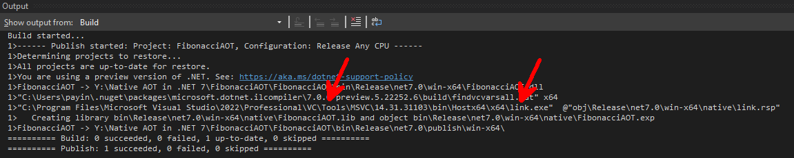
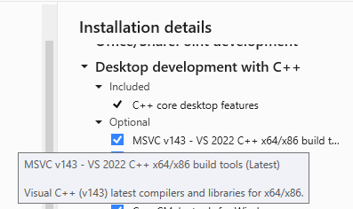

# Native AOT in .NET 7

Native AOT (Ahead of Time) is a group of technologies that help you build faster and lighter applications, by generating code at build time rather than at runtime, for .NET desktop client and server scenarios.

Native AOT generates 100% native code at build-time with no dependencies.

Native compiling for .NET has been around since the beginning of .NET.

[NGEN](https://docs.microsoft.com/en-us/dotnet/framework/tools/ngen-exe-native-image-generator) is a Native Image Generator for .NET Framework only.

[ReadyToRun](https://docs.microsoft.com/en-us/dotnet/core/deploying/ready-to-run) is a format used by [crossgen](https://devblogs.microsoft.com/dotnet/conversation-about-crossgen2/), a .NET Core tool that does a combination of compiling to native and IL (Just In Time).

[Mono AOT](https://www.mono-project.com/docs/advanced/aot/) is used by Xamarin. iOS doesn't allow JIT compiling, so something had to be done there. 

If you have been following Blazor, then you know about AOT for WASM, which uses Crossgen under the hood.

### Benefits of AOT

You can build self-contained apps that can be copied from system to system as long as they are the same.

Faster load time is great for container apps, and general purpose apps as well.

Smaller memory footprint because only the code that's required is loaded, not the entire CLR. Even though executable size is higher, if you look at memory being used it's much less.

Performance may or may not be sufficiently improved. It will be better, but how much depends on what you're doing.

### Drawbacks of AOT

No Loading assemblies using Reflection or using `Reflection.Emit` for code generation. 

May require tweaking for supporting dependencies.

Longer build times.

## Prerequisites

In order to take advantage of Native AOT the following prerequisites need to be installed.

### Windows

[.NET 7](https://dotnet.microsoft.com/en-us/download/dotnet/7.0)

[Visual Studio 2022 Preview](https://visualstudio.microsoft.com/vs/community/)

Enable Desktop development with C++ workload


## Demo

The following demo is a Console Application that captures the time to generate any given numbers using the Fibonacci sequence with and without Native AOT enabled.

### Create a Console Application called Fibonacci


Replace *Program.cs* with the following:

```csharp
using System.Diagnostics;

var numbersInSequence = 45;
var executions = 1;
var stopWatch = new Stopwatch();
var response = string.Empty;

stopWatch.Start();

for (int i = 1; i <= executions; i++)
{
    Fibonacci(0, 1, 1, numbersInSequence);
}

stopWatch.Stop();
Console.WriteLine($"\n\nTotal Time elapsed for {executions} executions: " +
    $"{stopWatch.ElapsedMilliseconds} milliseconds.");

static void Fibonacci(int firstNumber, int secondNumber, int numbersProcessed, 
    int numbersInSequence)
{
    Console.Write($"{firstNumber}{(numbersProcessed < numbersInSequence ? ", " : string.Empty)}");
    if (numbersProcessed < numbersInSequence)
    {
        Fibonacci(secondNumber, firstNumber + secondNumber, 
            numbersProcessed + 1, numbersInSequence);
    }
}
```

Fibonacci numbers are defined at [WikiPedia](https://en.wikipedia.org/wiki/Fibonacci_number):

> In mathematics, the **Fibonacci numbers**, commonly denoted *Fn*, form a [sequence](https://en.wikipedia.org/wiki/Integer_sequence), the **Fibonacci sequence**, in which each number is the sum of the two preceding ones.

The `Fibonacci` function fulfills this. You pass it the first number and the second number, the numbers processed, and the numbers in the sequence, and it calls itself after calculating the next number in the sequence. 

I've put the following line in the function to print out the number:

```c#
Console.Write($"{firstNumber}{(numbersProcessed < numbersInSequence ? ", " : string.Empty)}");
```

The `StopWatch` object measures the time it takes, which is displayed after the sequence is generated and runs.

Run the app and you should see something like this:


Outputting the series into the console adds an overhead because screen drawing.  Let's comment out the following line in the `Fibonacci` method:

```csharp
Console.Write($"{firstNumber}{(numbersProcessed < numbersInSequence ? ", " : string.Empty)}");
```

Running the app again shows that it took almost no time:


So, let's bump up the `numbersInSequence` and `executions` variables to 10,000:

```c#
var numbersInSequence = 10000;
var executions = 10000;
```

and run it again:


Now we have something we can compare.

Create a new Console Application for testing Native AOT called `FibonacciAOT` and copy the code from the first application's *Program.cs* to the new application

#### Enable Native AOT

In order to enable Native AOT we need to add a reference to the `ILCompiler` NuGet package, in order to use the Native AOT Compiler and runtime. Since is still in Preview, we first need to add a new NuGet Package source.

##### Add NuGet Package Source

.NET 7 NuGet Package Source

```http
https://pkgs.dev.azure.com/dnceng/public/_packaging/dotnet7/nuget/v3/index.json
```


Add a reference to the `ILCompiler` NuGet package.

> [!TIP]
> In the Manage NuGet Packages screen, make sure All or .NET 7 Preview under Package Source is selected, as well as the Include Prerelease checkbox is checked.


Create a Publishing Profile


Click on Show all settings and change the Target runtime to your desired runtime, in this case I changed it to win-x64


> [!TIP]
> If you expand the File publish options, ReadyToRun can be set there. We're not going to set this, but I just wanted to show you where it is.


Click Save to close Profile settings and Publish to publish the application.


> [!IMPORTANT]
> When building with Native AOT You want to see the ILCompiler is being used,


as opposed of the Roslyn compiler.


Once published, run the *FibonacciAOT.exe* file from the output folder.

### Results


###### Memory Utilization


###### Disk Utilization

- Without Native AOT

  

- With Native AOT

  

##### Other Findings

After doing some digging around, I found some useful information.

> [!IMPORTANT]
> The reason why the Desktop development with C++ workload is a prerequisite, is because of the Link process,



which come with the C++ Build Tools



> [!IMPORTANT]
> The location of the Native files used for building the application can be found in the obj folder.


> [!IMPORTANT]
> The location of the Native files once built can be found in the bin folder.


> [!NOTE]
> Building the application in Linux or macOS would generate Native files for each platform.

### Comparing Startup and Run Times

We can compare startup times using a `System.Diagnostics.Process` and timing it with a `StopWatch` object.

Add a new Console Application to the solution called `FibTimer` and replace the *Program.cs* with this:

```c#
using System.Diagnostics;

Console.WriteLine("Application Startup Timer. Enter path to .exe filename or drag it into the app");
string inputFileName = Console.ReadLine();
if (string.IsNullOrEmpty(inputFileName)) return;
// remove quotes
inputFileName = inputFileName.Replace("/q", "");

var process = new Process();
process.StartInfo.FileName = inputFileName;
var stopWatch = new Stopwatch();

stopWatch.Start();
process.Start();
stopWatch.Stop();

Console.WriteLine($"Startup for IL: {stopWatch.ElapsedMilliseconds}");
```

Set this app as the startup project, and run it. 

From the FIle Explorer, drop one of the .exe files onto it and press ENTER. 

You will see how long it took to load. The app will also run, so you get the benefit of testing the app itself at the same time.

Here are my results:

```
Fibonacci.exe:     Load Time: 19ms   Time to execute: 282ms
FibonacciAOT.exe:  Load Time: 12ms   Time to execute: 134ms
```

## Resources

|Resource Title                 |Url                                                     |
|-------------------------------|--------------------------------------------------------|
|Download .NET 7.0              |<https://dotnet.microsoft.com/en-us/download/dotnet/7.0>|
|Visual Studio 2022 Preview     |<https://visualstudio.microsoft.com/vs/community/>|
|Compiling with Native AOT      |<https://github.com/dotnet/runtime/blob/main/src/coreclr/nativeaot/docs/compiling.md>|
|Native AOT Pre-requisites      |<https://github.com/dotnet/runtime/blob/main/src/coreclr/nativeaot/docs/prerequisites.md>|
|ReadyToRun                     |<https://docs.microsoft.com/en-us/dotnet/core/deploying/ready-to-run>|
|Mono AOT                       |<https://www.mono-project.com/docs/advanced/aot/>|